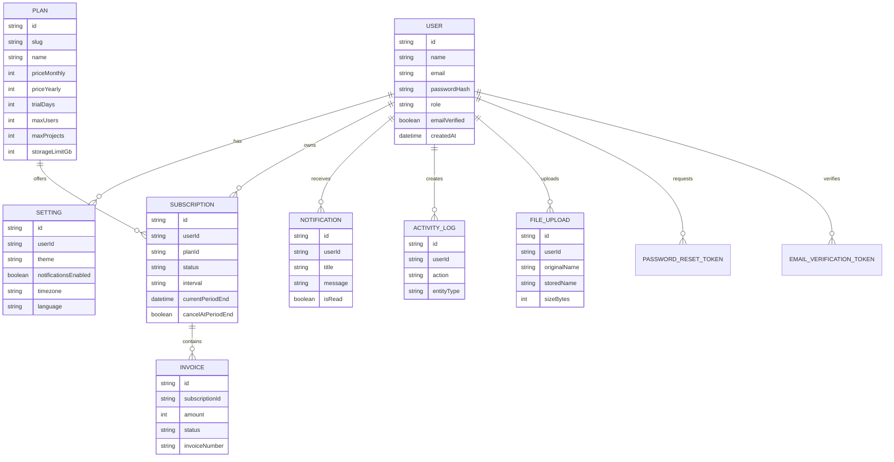

# Database ERD

```mermaid
erDiagram
  USER ||--o{ SETTING : has
  USER ||--o{ SUBSCRIPTION : owns
  USER ||--o{ NOTIFICATION : receives
  USER ||--o{ ACTIVITY_LOG : creates
  USER ||--o{ FILE_UPLOAD : uploads
  USER ||--o{ PASSWORD_RESET_TOKEN : requests
  USER ||--o{ EMAIL_VERIFICATION_TOKEN : verifies
  PLAN ||--o{ SUBSCRIPTION : offers
  SUBSCRIPTION ||--o{ INVOICE : contains

  USER {
    string id
    string name
    string email
    string passwordHash
    string role
    boolean emailVerified
    datetime createdAt
  }

  SETTING {
    string id
    string userId
    string theme
    boolean notificationsEnabled
    string timezone
    string language
  }

  PLAN {
    string id
    string slug
    string name
    int priceMonthly
    int priceYearly
    int trialDays
    int maxUsers
    int maxProjects
    int storageLimitGb
  }

  SUBSCRIPTION {
    string id
    string userId
    string planId
    string status
    string interval
    datetime currentPeriodEnd
    boolean cancelAtPeriodEnd
  }

  INVOICE {
    string id
    string subscriptionId
    int amount
    string status
    string invoiceNumber
  }

  NOTIFICATION {
    string id
    string userId
    string title
    string message
    boolean isRead
  }

  ACTIVITY_LOG {
    string id
    string userId
    string action
    string entityType
  }

  FILE_UPLOAD {
    string id
    string userId
    string originalName
    string storedName
    int sizeBytes
  }
```
